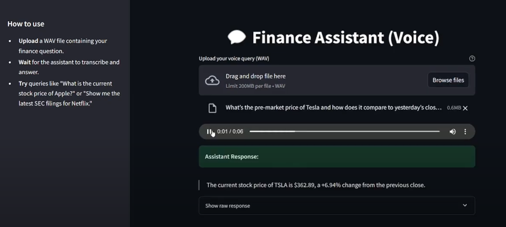

# 🧠 Multi-Agent Finance Assistant

[](https://www.python.org/downloads/)
[](https://fastapi.tiangolo.com/)
[](https://www.docker.com/)

A sophisticated voice-enabled financial analysis system that delivers real-time market briefs through orchestrated AI agents. Built with FastAPI microservices, Streamlit frontend, and powered by advanced RAG (Retrieval-Augmented Generation) capabilities.

## 🚀 Demo

[](https://www.youtube.com/watch?v=skZHYClgcSU)

---

## ✨ Features

- 🎙️ **Voice Interface**: Speech-to-text → AI processing → Audio response
- 📊 **Real-Time Data**: Live stock prices, earnings, market news
- 🔍 **Smart Search**: RAG-powered document retrieval from Pinecone
- 🤖 **Multi-Agent**: Specialized agents for different data sources
- 📱 **Web Dashboard**: Streamlit interface with voice controls

**Example Query:** *"What's our Asia tech exposure and any earnings surprises?"*
**Response:** *"Asia tech is 22% of AUM, up from 18%. TSMC beat by 4%, Samsung missed by 2%."*

---

## 🏗️ Architecture

| Agent | Purpose | Tech Stack |
|-------|---------|------------|
| **STT Agent** | Speech-to-text | Whisper, FastAPI |
| **API Agent** | Market data | yfinance, AlphaVantage |
| **Scraping Agent** | News/filings | BeautifulSoup |
| **Retriever Agent** | Document search | Pinecone, FAISS |
| **Analysis Agent** | Risk analysis | Pandas, NumPy |
| **Language Agent** | Response generation | OpenAI GPT |

```
Audio → STT → Intent Classification → Data Retrieval → Analysis → Language Generation → Response
```

---

## 🚀 Quick Start

### 1. Clone & Setup
```bash
git clone https://github.com/lasyaMundrathi/multi-agent-finance-assistant.git
cd multi-agent-finance-assistant
python -m venv venv && source venv/bin/activate  # or venv\Scripts\activate on Windows
pip install -r requirements.txt
```

### 2. Configure Environment
```bash
cp .env.example .env
# Add your API keys:
# OPENAI_API_KEY=your_key
# PINECONE_API_KEY=your_key
```

### 3. Run Application
```bash
# Option 1: Docker (Recommended)
docker-compose up --build

# Option 2: Local
python orchestrator.py
streamlit run frontend/streamlit_app.py
```

### 4. Access
- **Web Interface**: http://localhost:8501
- **API Docs**: http://localhost:8000/docs

---

## 📡 API Endpoints

```bash
# Main voice query
POST /query (audio file) → natural language response

# Individual services  
POST /stt (audio) → transcribed text
GET /market-data?ticker=AAPL → stock data
POST /retrieve {"query": "earnings"} → relevant documents
POST /analyze {"data": [...]} → risk analysis
```

---

## 💡 Usage Examples

**Voice Queries:**
- *"What's Apple's current price?"*
- *"Analyze our tech sector risk"*
- *"Latest Tesla earnings summary"*
- *"Energy sector news today"*

**API Usage:**
```python
import requests
response = requests.post(
    "http://localhost:8000/query",
    files={"audio": open("query.wav", "rb")}
)
```

---

## 🛠️ Requirements

- Python 3.11+
- OpenAI API key
- Pinecone account (for vector storage)
- Optional: Alpha Vantage API key

---

## 🤝 Contributing

1. Fork the repo
2. Create feature branch: `git checkout -b feature-name`
3. Make changes and test
4. Submit pull request

**Need help?** Open an [issue](https://github.com/lasyaMundrathi/multi-agent-finance-assistant/issues)

---
